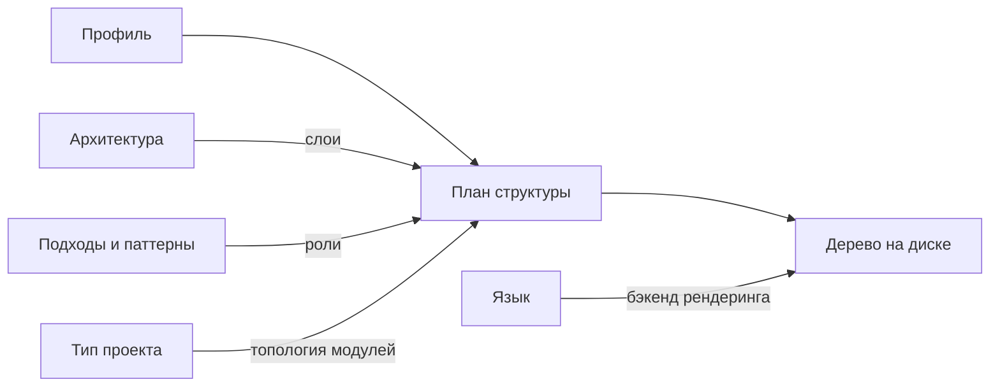

# План разработки Extruder

Порядок работ над Extruder: единый язык проекта, выбранная технология, модель решения задачи
профиля, определение готовности результата, карта последующих change'ей и процедура приёмки плана.

---

## Навигация

- [Единый язык](#единый-язык)
- [Технологическое решение](#технологическое-решение)
- [Модель решения](#модель-решения)
- [Определение готовности](#определение-готовности)
- [Карта change'ей](#карта-changeей)
- [Что Extruder создаёт](#что-extruder-создаёт)
- [Границы первой версии](#границы-первой-версии)
- [Журнал приёмки](#журнал-приёмки)
- [Цикл ревизий](#цикл-ревизий)
- [Версионирование](#версионирование)

---

## Единый язык

Понятия проекта раскрываются здесь один раз и далее по всем документам употребляются в закреплённой
форме ([TERM-001](../rules/terminology.md#единый-источник-определения),
[TERM-004](../rules/terminology.md#ввод-аббревиатуры-в-тексте)).

- **Профиль (Profile)** — набор значений всех измерений, задающий, какую структуру создаёт
  Extruder. Состав профиля описан в [`README.md`](../README.md#архитектурный-профиль).
- **Измерение (Dimension)** — независимая ось выбора в профиле: язык, тип проекта, архитектура,
  подходы и паттерны. Значение одного измерения не ограничивает выбор в остальных.
- **Модуль (Module)** — единица верхнеуровневого доменного разбиения создаваемого проекта
  ([CLAR-022](../rules/clean-architecture.md#модульная-организация-clar-022023)).
- **Слой (Layer)** — логическая группа внутри модуля: домен, приложение, инфраструктура
  ([CLAR-001](../rules/clean-architecture.md#слои-и-направление-зависимостей-clar-001)).
- **Роль (Role)** — назначение отдельного элемента внутри слоя: сущность, объект-значение,
  сценарий использования, контракт репозитория и прочие элементы состава слоя.
- **План структуры (Structure Plan)** — промежуточное представление будущего проекта в понятиях
  модулей, слоёв и ролей, ещё не привязанное ни к какому языку.
- **Узел (Node)** — элемент плана структуры: модуль, слой или роль. Каталогом или файлом узел
  становится на шаге рендеринга, когда подключается язык.
- **Пакет измерения (Dimension Pack)** — декларативное описание одного значения измерения вместе
  с шаблонами ролей.
- **Бэкенд рендеринга (Rendering Backend)** — компонент, переводящий план структуры в дерево
  файлов конкретного языка.

> **Примечание:** аббревиатуры за этими понятиями не закрепляются: они употребляются в тексте
> целиком, и сокращение сделало бы документы менее читаемыми, не сократив ни одного повтора.

---

## Технологическое решение

Extruder реализуется на Go.

| Критерий | Go | Rust | Python | TypeScript/Node | PHP |
|----------|----|------|--------|-----------------|-----|
| Единый бинарник без рантайма у пользователя | да | да | нет | нет | нет |
| Шаблоны внутри артефакта поставки | `embed` (stdlib) | внешний крейт | `importlib.resources` | сборщик | phar |
| Абстракция файлового дерева в stdlib | `io/fs` | нет | нет | нет | нет |
| Виртуальная ФС для тестов в stdlib | `testing/fstest` | нет | нет | нет | нет |
| Шаблонизатор в stdlib | `text/template` | нет | нет | нет | нет |
| Скорость разработки | высокая | низкая | высокая | высокая | средняя |

### Довод первый: абстракции стандартной библиотеки

Стандартная библиотека Go содержит ровно те три абстракции, которыми работает вторая фаза
преобразования: дерево файлов как интерфейс (`io/fs`), вшивание базы знаний в артефакт поставки
(`embed`) и виртуальная файловая система для тестов (`testing/fstest`).

Каждая закрывает свою работу:

| Работа | Абстракция | Выигрыш |
|--------|------------|---------|
| Чтение шаблонов ролей | `fs.FS` | вшитые в бинарник и подключённый каталог читаются одной функцией |
| Отрендеренное дерево | `fs.FS` | обход и запись на диск не зависят от того, откуда дерево взялось |
| Golden-тест | `testing/fstest` | эталон задаётся в тесте, диск не нужен |

Все три работы — о настоящих файлах: у узла есть путь и содержимое. **План структуры в их число
не входит:** ни пути, ни содержимого у него нет, и выражается он обычной структурой данных —
см. [«Модель решения»](#модель-решения).

### Довод второй: единый бинарник без рантайма

Инструмент, создающий проекты на чужих языках, обязан запускаться там, где нет ни Go, ни Python,
ни Node. Единый статический бинарник это обеспечивает.

### Довод третий: самоприменимость

Go входит в перечень поддерживаемых языков, поэтому первый бэкенд рендеринга пишется на том же
языке, на котором написано ядро: ошибка в ядре и ошибка в бэкенде обнаруживаются одним прогоном.

### Отклонённые альтернативы

| Кандидат | Причина отклонения |
|----------|--------------------|
| Rust | даёт те же свойства распространения, но выигрыша не приносит при более высоком пороге входа и меньшей скорости итераций |
| Python | требует рантайма у пользователя; перечисленных абстракций в стандартной библиотеке нет |
| TypeScript/Node | требует рантайма у пользователя; вшивание шаблонов возлагается на сборщик |
| PHP | требует рантайма у пользователя; перечисленных абстракций в стандартной библиотеке нет |

---

## Модель решения

Преобразование профиля в структуру проекта разбито на две фазы: сначала строится план структуры
в абстрактных понятиях, и только затем он переводится в дерево на диске.



Архитектура задаёт слои, подходы и паттерны — роли внутри слоёв, тип проекта — топологию модулей.
Все три измерения работают в абстрактных понятиях и языка не знают. Язык подключается только
на последнем шаге: он переводит абстрактную роль в конкретный путь и содержимое файла.

### План структуры — контракт между фазами

Главное, что производит первая фаза, — не дерево, а **контракт**, по которому с ней разговаривает
бэкенд рендеринга. Построение плана можно переписать сколько угодно раз, контракт переживёт: именно
его неизменность проверяет экзамен второго языка на этапе 5.

Контракт обязан нести ровно четыре вещи:

- какие модули есть и как они вложены;
- какие слои внутри каждого модуля;
- какие роли внутри каждого слоя — **с опознаваемой идентичностью роли**: по ней бэкенд выбирает
  шаблон и правило именования;
- связи между узлами там, где они нужны.

И не нести ничего от языка: ни имени файла, ни расширения, ни содержимого.

Отсюда форма: **обычная структура данных с типизированной ролью**, а не файловая система.

| Требование к контракту | Структура с типом | `fs.FS` |
|------------------------|-------------------|---------|
| Несёт идентичность роли | поле типа `Role` | негде: интерфейс несёт имя, байты и признак каталога — роль пришлось бы кодировать в строке пути |
| Несуществующая роль не проходит | не компилируется | опечатка в строке компилируется и проходит тест |
| Бэкенду не нужен разбор | `switch node.Role` | резать путь по `/` и сравнивать сегменты — строка разбирается обратно в то, чем была |
| Содержимое узла | не предусмотрено | `Read` обязателен и всегда возвращает ноль байт |

`fs.FS` окупается на шаге рендеринга и дальше, где у узла появляются и путь, и байты —
см. [«Технологическое решение»](#технологическое-решение), довод первый.

### Предъявление плана и утверждение записи

План структуры **предъявляется пользователю всегда**, как промежуточный вывод, а не по флагу.
Причина простая: план — единственное, что можно проверить глазами до того, как на диске появятся
файлы. Флаг, скрывающий его по умолчанию, оставил бы это преимущество невостребованным.

С появлением записи на диск предъявление превращается в **шаг утверждения**: инструмент печатает
план, спрашивает подтверждение и только после него раскладывает файлы. Так свойство двухфазной
модели — «результат можно предъявить до записи», которым отклонены оверлеи, — становится функцией,
а не только доводом.

Каталог назначения пользователем не задаётся: инструмент раскладывает структуру там, откуда
запущен, — выбор каталога есть переход в него до вызова. Запись целиком отвергается, если путь
хотя бы одного узла совпадает с уже существующим файлом: так соседство с посторонними файлами
остаётся возможным, а перезапись — нет.

Утверждение обязано иметь неинтерактивный обход, иначе им нельзя пользоваться из сценариев:

- вопрос идёт в стандартный поток ошибок, ответ читается со стандартного ввода;
- флаг подтверждения пропускает вопрос целиком;
- если стандартный ввод не терминал, а флаг не задан, инструмент **завершается отказом с внятным
  сообщением** — не спрашивает в пустоту и не пишет молча.

Без этого правила приёмочные тесты повисли бы на первом же вопросе: они запускают бинарник
во временном каталоге, и отвечать в них некому.

Предъявление плана относится к этапу 2, утверждение записи — к этапу 3: на этапе 2 утверждать
нечего, план там и есть весь результат.

### Почему произведение вариантов становится суммой

Наивная модель — шаблон на каждую комбинацию профиля — требует по шаблону на каждое сочетание
значений четырёх измерений. Пять языков, четыре типа проекта, четыре архитектуры и подмножества
из четырёх паттернов дают около 1280 шаблонов, причём каждый новый язык умножает весь остальной
объём.

В двухфазной модели слои, роли и топология описаны один раз и от языка не зависят, а язык
представлен одним бэкендом рендеринга. Новый язык добавляется одним бэкендом и сразу работает
со всеми архитектурами, паттернами и типами проекта; новая архитектура добавляется одним описанием
и сразу работает со всеми языками. Объём знания растёт суммой измерений, а не их произведением.

### Отклонённая альтернатива без абстрактной фазы

Оверлеи, напрямую накладывающие файлы друг на друга, отклонены: без промежуточного представления
результат нельзя ни предъявить пользователю до записи на диск, ни проверить тестом без обращения
к файловой системе.

---

## Определение готовности

Сгенерированная структура считается готовой, когда выполнены четыре условия одновременно:

1. тулчейн целевого языка собирает проект;
2. линтер целевого языка молчит;
3. тесты-заготовки проходят;
4. дерево совпадает с эталоном.

Планка — «компилируется, линтер чист, тесты зелёные», но не «работает бизнес-логика»: заготовка
роли остаётся минимальной, однако обязана быть валидным кодом, а не пустым файлом.

### Два рода тестов

| Род теста | Что проверяет | Где выполняется |
|-----------|---------------|-----------------|
| Golden-тест | совпадение построенного дерева с эталоном (условие 4) | в памяти, на виртуальной файловой системе `testing/fstest`; тулчейн целевого языка не нужен |
| Приёмочный тест | сборку, линтер и тесты-заготовки сгенерированного проекта (условия 1–3) | во временном каталоге, с запуском тулчейна целевого языка |

Golden-тесты остаются полной проверкой логики ядра и выполняются везде, включая контейнер агента.
Приёмочные тесты выполняются там, где тулчейн целевого языка доступен.

> **Внимание:** каждый поддержанный язык требует своего тулчейна в окружении проверки. Это
> осознанный предел темпу добавления языков: он же не даёт накопить непроверенные бэкенды.

Следствие для содержания генерации: к дереву добавляется всё, без чего сборка невозможна —
манифест модуля, точка входа, цель сборки, минимальный проходящий тест. Шаблоны ролей поэтому
содержательны с самого начала, и формат пакетов измерения проектируется под шаблоны с телом
и подстановками, а не под перечень путей.

---

## Карта change'ей

Работы разбиты на этапы; каждому этапу соответствует отдельный change, создаваемый по одному,
а не пакетом. Этапы 0 и 1 объединены в один change: модель профиля без интерфейса предъявить
нечем.

| Этап | Change | Границы | Критерий готовности |
|------|--------|---------|---------------------|
| 0–1 | `bootstrap-extruder-cli` | каркас модуля Go, цели сборки и линтера, модель профиля, разбор профиля из аргументов командной строки; на диск не пишет | профиль разбирается и печатается в стандартный вывод; сборка и линтер чисты; ошибочный профиль отвергается с внятным сообщением |
| 2 | `add-structure-plan` | контракт между фазами: несёт модули, слои и роли, не несёт ничего от языка; построение плана из профиля за этим контрактом, [предъявление плана](#предъявление-плана-и-утверждение-записи) в стандартный поток вывода. Форма контракта — решение change'а | план первого вертикального среза (Go, сервис, Layered, без паттернов) совпадает с эталоном в тесте, без обращения к файловой системе; ни один компонент фазы не ссылается на язык |
| 3 | `render-plan-to-filesystem` | первый бэкенд рендеринга (Go), запись дерева в каталог запуска, шаблоны ролей с телом, [утверждение записи](#предъявление-плана-и-утверждение-записи) с неинтерактивным обходом | сгенерированный проект удовлетворяет всем четырём условиям [определения готовности](#определение-готовности); приёмочный тест проходит; без утверждения запись не происходит, а при неинтерактивном вводе без флага подтверждения инструмент завершается отказом, а не пишет молча; при столкновении имени запись не начинается, существующие файлы не перезаписываются |
| 4 | `extract-dimension-packs` | вынос знания об измерениях из кода в пакеты измерения, вшитые через `embed`, с возможностью подключить внешний каталог | поведение этапа 3 не изменилось: те же golden- и приёмочные тесты проходят без правки ожиданий |
| 5 | `add-second-language-backend` | второй бэкенд рендеринга — экзамен разделения фаз | второй язык добавлен без единой правки ядра и фазы плана структуры; приёмочный тест нового языка проходит |
| 6 | `add-architecture-dimension` | измерение «архитектура»: Clean Architecture, Ports & Adapters, Layered и прочие как пакеты измерения | каждая архитектура генерируется на обоих языках и удовлетворяет определению готовности |
| 7 | `add-pattern-dimension` | измерение «подходы и паттерны»: Domain-Driven Design (DDD), Command Query Responsibility Segregation (CQRS) и прочие как оверлеи ролей | каждый паттерн накладывается на каждую архитектуру; результат удовлетворяет определению готовности |
| 8 | `add-project-type-dimension` | измерение «тип проекта»: монолит, модульный монолит, сервис, распределённая система — топология модулей | каждый тип проекта генерируется на обоих языках со всеми архитектурами; результат удовлетворяет определению готовности |
| 9 | `persist-profile-in-project` | запись профиля в сгенерированный проект: имя файла, формат, место в дереве | сгенерированный проект содержит файл профиля; профиль читается обратно и даёт то же дерево |
| 10 | `warn-on-incompatible-combinations` | предупреждения о практически несочетаемых комбинациях измерений | заведомо спорное сочетание сопровождается предупреждением и при этом генерируется; ни одна комбинация не запрещена |

### Почему экзамен второго языка стоит раньше контента

Этап 5 — не функциональность, а проверка правильности разделения фаз, выполненного на этапе 2.
Если язык незаметно протёк в абстрактную фазу, узнать об этом нужно до того, как накоплены четыре
архитектуры и три паттерна: после накопления та же ошибка исправляется правкой всего контента,
а не одного места. Критерий экзамена поэтому сформулирован отрицанием — ядро не правится ни строкой.

> **Внимание:** карта составлена до появления кода и может разойтись с реальным устройством плана
> структуры после этапа 2. Расхождение фиксируется ревизией этого документа с записью в
> [журнал приёмки](#журнал-приёмки), а не молчаливым отклонением от карты.

---

## Что Extruder создаёт

Решение отвечает на вопрос, который предшествует всем остальным: **что подаётся на вход
и насколько наполненный результат ожидается на выходе.**

### Две возможные версии продукта

| | Раскладчик | Генератор по описанию |
|---|---|---|
| Вход | только профиль | профиль плюс описание предметной области: домены, сущности, действия |
| Выход | каркас с заглушкой на каждую роль | структура с именами из описания |
| Что делает пользователь до первого результата | одну команду | изучает формат описания и пишет файл |
| Сколько раз применяется | один раз, на старте проекта | многократно, по мере роста описания |
| Что требуется спроектировать сверх плана | ничего | формат описания, его схему, проверку, диагностику, версии формата |
| Golden-тесты | комбинаций профиля конечное число | описаний бесконечно много, эталоны не перечислить |

### Решение: первая версия — раскладчик

Extruder первой версии создаёт **каркас по профилю**. Описания предметной области он не
принимает, доменных имён не знает: элемент каждой роли именуется по самой роли — `Entity`,
`Repository`, `UseCase`. Полученные имена разработчик переименовывает под свою задачу сам.

Два довода.

**Первый — генератор по описанию немедленно требует того, что вынесено за границы первой
версии.** Описание живёт и меняется: сегодня у домена три действия, завтра четыре. Пользователь
дописывает строку и запускает снова — а первая версия пишет в пустой каталог и чужое дерево
не разбирает, то есть второй запуск затирает написанное человеком. Генератор по описанию
бесполезен после первого запуска без умения дорастить существующую структуру, а это отдельный
исключённый пункт. У раскладчика такой связки нет: каркас создаётся один раз, дальше проект
живёт сам.

**Второй — формат описания пришлось бы проектировать вслепую.** Ни одного сгенерированного
каркаса ещё нет, и неизвестно, какие подстановки шаблонам ролей действительно нужны. Это тот же
довод, по которому вынос знания об измерениях в пакеты отложен до этапа 4.

### Решение обратимо в нужную сторону

Описание предметной области, если оно понадобится, становится **вторым входом первой фазы**,
а не переделкой модели:

```text
 Профиль ──────────┐
                   ├──► План структуры ──► Бэкенд рендеринга ──► Дерево
 Описание домена ──┘
   (появится позже)
```

Контракт раскладчика — подмножество контракта генератора: узел роли получает имя там, где сейчас
подставляется имя роли. Бэкенды при этом не переписываются — они и так выбирают шаблон по роли.
Движение «раскладчик → генератор» есть дополнение, обратное — выбрасывание, поэтому такой порядок
дешевле в обе стороны.

### Следствие для контракта

Строковых имён в плане структуры нет. Имя понадобится там, где элементы одного вида нужно
различать, — у модулей, когда их станет несколько, то есть с этапа 8. Имя проекта в манифесте
модуля берётся из каталога назначения на этапе 3 и контракта не касается.

---

## Границы первой версии

Первая версия Extruder создаёт **начальную** структуру нового проекта. Первые два пункта
ниже следуют из решения [«Что Extruder создаёт»](#что-extruder-создаёт) и приведены здесь
перечнем; остальные самостоятельны. Вне объёма первой версии явно остаются:

- **дорастить существующую структуру** — вписать новый модуль, слой или роль в уже существующий
  проект. Первая версия чужое дерево не разбирает: она раскладывает узлы в каталоге запуска
  и отказывается целиком, если имя хотя бы одного узла уже занято. Соседство с посторонними
  файлами при этом допустимо, перезаписи не происходит ни при каком ответе пользователя;
- **генерация бизнес-логики** — заготовка роли остаётся минимальным валидным кодом; правила
  предметной области Extruder не придумывает;
- **генерация миграций** — схема хранения и её версии не создаются;
- **генерация пайплайнов** — конфигурация сборочных и проверочных пайплайнов не создаётся;
- **плагины в виде исполняемого кода** — расширение идёт декларативными пакетами измерения;
  подключать к Extruder чужой исполняемый код первая версия не умеет.

---

## Журнал приёмки

Журнал фиксирует решения пользователя по этому документу: что решено, по какой причине отклонено
и что изменено в ответ. От [таблицы версий](#версионирование) он отличается предметом: таблица
версий отвечает на вопрос «что изменилось в документе», журнал — на вопрос «какое решение принял
пользователь и почему».

| Итерация | Дата | Решение | Причина отказа | Ответная доработка |
|----------|------|---------|----------------|--------------------|
| 1 | 2026-09-28 | принят | — | — |
| 2 | 2026-09-28 | принят (ревизия 1.1.0) | — | Добавлен раздел «Что Extruder создаёт»: первая версия — раскладчик по профилю, описания предметной области не принимает. Вопрос всплыл при планировании этапа 2: определение готовности требует валидного кода, валидный код требует идентификаторов, а в профиле имён нет |
| 3 | 2026-09-28 | принят (ревизия 1.2.0) | — | Форма контракта этапа 2 исправлена: план структуры — обычная структура данных с типизированной ролью, `fs.FS` начинается с шага рендеринга. Причина правки: `fs.FS` не может нести идентичность роли — интерфейс несёт имя, байты и признак каталога, — поэтому роль пришлось бы кодировать в строке пути и разбирать обратно |
| 4 | 2026-09-28 | принят (ревизия 1.3.0) | — | План предъявляется всегда, как промежуточный вывод, а не по флагу; с появлением записи на диск предъявление становится шагом утверждения. Предложено пользователем при планировании этапа 2 |
| 5 | 2026-09-29 | принят (ревизия 1.4.0) | — | Граница «первая версия пишет в пустой каталог» заменена отказом при столкновении имён: каталог назначения аргументом не задаётся, структура раскладывается в каталоге запуска, соседство с посторонними файлами допустимо, перезаписи нет. Решено пользователем при планировании этапа 3 |

---

## Цикл ревизий

Приёмка плана — явная процедура, а не умолчание.

1. План предъявляется пользователю с указанием решений, требующих подтверждения.
2. Пользователь принимает явное решение: «принят» или «не принят». Молчание решением не считается.
3. При отказе **причина записывается в журнал приёмки до начала доработки**, затем повышается
   версия документа, вносятся правки, и план предъявляется снова.
4. При приёмке в журнал заносится решение «принят» с датой; дальнейшие правки плана идут
   отдельными ревизиями.

Число итераций не ограничено, но каждая итерация адресует **конкретную зафиксированную причину
отказа**: причина без записи в журнале доработку не запускает. Это и не даёт циклу зациклиться —
доработка всегда отвечает на названное возражение, а не на общее недовольство.

> **Важно:** запись причины после внесения правок превращает журнал в пересказ уже сделанного
> и лишает его смысла. Порядок «сначала причина, потом правка» обязателен.

---

## Версионирование

| Версия | Дата | Задача | Агент | Модель | Описание изменений |
|--------|------|--------|-------|--------|--------------------|
| 1.0.0 | 2026-09-28 | OpenSpec change `plan-extruder-development` | Claude Code | Claude Opus 5 | Начальное создание: единый язык проекта (профиль, измерение, модуль, слой, роль, план структуры, узел, пакет измерения, бэкенд рендеринга), выбор Go с таблицей сравнения кандидатов и тремя доводами, двухфазная модель с языком на последнем шаге, определение готовности из четырёх условий с разделением golden- и приёмочных тестов, карта change'ей на этапы 0–10 с критерием готовности у каждого, границы первой версии, журнал приёмки и цикл ревизий |
| 1.0.1 | 2026-09-28 | OpenSpec change `plan-extruder-development` | Claude Code | Claude Opus 5 | В журнал приёмки внесено решение пользователя по итерации 1 — «принят»; содержание плана не изменялось. Дальнейшие правки плана идут отдельными ревизиями по разделу «Цикл ревизий» |
| 1.1.0 | 2026-09-28 | Ревизия при планировании change `add-structure-plan` | Claude Code | Claude Opus 5 | Добавлен раздел «Что Extruder создаёт» — граница создания вынесена в самостоятельное решение с приёмкой вместо вывода из двух пунктов списка запретов: сопоставлены раскладчик и генератор по описанию, выбран раскладчик (генератор немедленно требует умения дорастить существующую структуру, а формат описания проектировался бы вслепую), зафиксирована обратимость решения через второй вход первой фазы и следствие для контракта — строковых имён в плане структуры нет. Вступление раздела «Границы первой версии» связано с новым решением: первые два пункта перечня следуют из него |
| 1.2.0 | 2026-09-28 | Ревизия при планировании change `add-structure-plan` | Claude Code | Claude Opus 5 | Исправлено требование к форме плана структуры. В доводе первом «Технологического решения» удалено утверждение, что план структуры становится реализацией `fs.FS`: три абстракции стандартной библиотеки отнесены к работам второй фазы (чтение шаблонов, отрендеренное дерево, golden-тест), где у узла есть путь и содержимое. В «Модель решения» добавлен раздел «План структуры — контракт между фазами»: перечислено, что контракт обязан нести, и сопоставлены структура с типизированной ролью и `fs.FS`. Определение узла в едином языке переведено с «каталог или файл» на «модуль, слой или роль». В карте change'ей граница этапа 2 переформулирована через контракт, форма контракта оставлена решением change'а, критерий готовности переведён с golden-теста на сравнение плана с эталоном без обращения к файловой системе |
| 1.3.0 | 2026-09-28 | Ревизия при планировании change `add-structure-plan` | Claude Code | Claude Opus 5 | Добавлен раздел «Предъявление плана и утверждение записи»: план структуры предъявляется всегда, а не по флагу — иначе преимущество «предъявить результат до записи», которым отклонены оверлеи, остаётся невостребованным; с появлением записи предъявление превращается в шаг утверждения, для которого зафиксирован обязательный неинтерактивный обход — вопрос в поток ошибок, флаг подтверждения пропускает вопрос, при неинтерактивном вводе без флага инструмент завершается отказом, а не пишет молча. В карте change'ей строка этапа 2 дополнена предъявлением плана, строка этапа 3 — утверждением записи и соответствующим критерием готовности |
| 1.4.0 | 2026-09-29 | Ревизия при планировании change `render-plan-to-filesystem` | Claude Code | Claude Opus 5 | Граница первой версии приведена к принятому решению о каталоге назначения: вместо «первая версия пишет в пустой каталог» зафиксировано, что инструмент раскладывает узлы в каталоге запуска и отказывается целиком при столкновении имени хотя бы одного узла, а соседство с посторонними файлами допустимо и перезаписи не происходит. Раздел «Предъявление плана и утверждение записи» дополнен тем, что каталог назначения пользователем не задаётся — выбор каталога есть переход в него до вызова. В карте change'ей строка этапа 3 переведена с «запись дерева на диск» на запись в каталог запуска, а её критерий готовности дополнен условием «при столкновении имени запись не начинается» |
