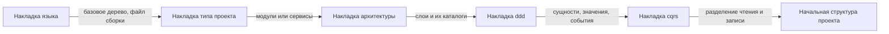
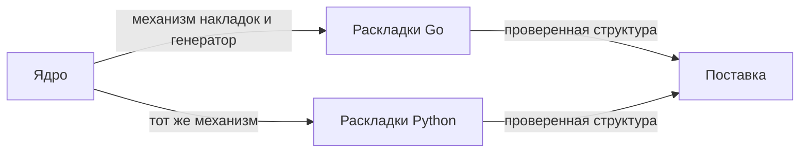
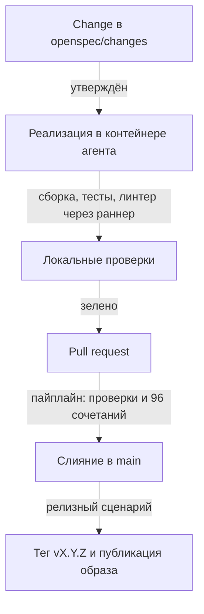

# План реализации Extruder v1

Как из принятых решений получается работающий инструмент: схема работы Extruder, конвейер
генерации, порядок реализации четырьмя этапами и технологический процесс разработки.
Состав решений — в [`extruder-design.md`](./extruder-design.md), канонические имена понятий —
в [`domain-language.md`](./domain-language.md).

---

## Навигация

- [Что строим](#что-строим)
- [Как работает Extruder](#как-работает-extruder)
- [Конвейер генерации](#конвейер-генерации)
- [Порядок реализации](#порядок-реализации)
- [Технологический процесс](#технологический-процесс)
- [Где что выполняется](#где-что-выполняется)
- [Критерии готовности](#критерии-готовности)
- [Риски и ограничения](#риски-и-ограничения)
- [Версионирование](#версионирование)

---

## Что строим

Extruder — CLI-инструмент на Go, распространяемый образом контейнера. Пользователь монтирует
пустой каталог, отвечает на вопросы опроса и получает начальную структуру проекта под выбранный
архитектурный профиль: дерево каталогов, файл сборки, конфигурацию линтера, сквозной пример
одного домена и проходящий тест.

Профиль собирается из четырёх измерений — 96 допустимых сочетаний:

| Измерение | Значения | Выбор |
|-----------|----------|-------|
| Язык | `go`, `python` | одиночный |
| Тип проекта | `monolith`, `modular-monolith`, `service`, `distributed` | одиночный |
| Архитектура | `clean-architecture`, `ports-adapters`, `layered` | одиночный |
| Паттерны | `ddd`, `cqrs` | множественный, допустим пустой набор |

---

## Как работает Extruder

Один запуск — от старта контейнера до записанной начальной структуры.

Ключевое свойство: до момента переноса целевой каталог не изменён. Прерывание на любом шаге
оставляет его ровно таким, каким он был.

---

## Конвейер генерации

Профиль превращается в начальную структуру наложением накладок в строго заданном порядке.
Порядок детерминирован и не зависит ни от порядка ответов пользователя, ни от алфавита.

Накладка, применённая позже, перезаписывает файл, созданный ранее. Это принятое поведение,
а не дефект: паттерны уточняют то, что задала архитектура. Обратная сторона — молчаливая потеря
файла, см. [Риски и ограничения](#риски-и-ограничения).

---

## Порядок реализации

Работа разбита на четыре изменения OpenSpec. Разбиение идёт по швам зависимостей: ядро можно
закончить и проверить до появления второй языковой раскладки, а поставка не зависит ни от чего,
кроме готового приёмочного прогона.

| Этап | Состав | Готов, когда |
|------|--------|--------------|
| Ядро | Профиль и словарь значений, опрос, конвейер накладок, манифест, повторный запуск, атомарная запись | На заглушечных накладках генерируется начальная структура, манифест читается повторным запуском |
| Раскладки Go | Базовое дерево `go.mod`, `cmd/`, `internal/`, накладки типов проекта, трёх архитектур, `ddd`, `cqrs`, сквозной пример | Все 48 сочетаний с `go` собираются, тест внутри проходит, `golangci-lint` чист |
| Раскладки Python | Базовое дерево src-layout, `pyproject.toml` с `uv`, те же накладки для Python | Все 48 сочетаний с `python` проходят `pytest` и `ruff` |
| Поставка | `Dockerfile` на `scratch`, цель сборки образа, пайплайн проверок и публикации, файл версии и релизный сценарий, цели сборки в `Makefile` и белый список раннера | Тег `vX.Y.Z` даёт опубликованный образ в реестре |

---

## Технологический процесс

Цикл одного изменения — от постановки до релиза.

Правила процесса, действующие на каждом шаге:

- ветка отражает один поток изменений, `main` защищена — [GIT-005](../rules/git-rules.md#рабочая-ветка);
- заголовок коммита — `EXT-NNN: описание задачи`, номер и описание подтверждаются
  до коммита — [GIT-009](../rules/git-rules.md#формат-сообщения-коммита),
  [GIT-010](../rules/git-rules.md#формат-сообщения-коммита);
- после любой правки `Makefile` обязателен прогон `sh tools/make-lint/check.sh` —
  [MAKE-004](../rules/makefile-rules.md#локальный-прогон-проверки-make-004);
- содержимое `openspec/changes/archive/` не читается никогда —
  [READ-004](../rules/reading-rules.md#запрет-каталогов-read-004).

---

## Где что выполняется

Разделение существенно: в контейнере агента нет ни `make`, ни `docker`, ни Go.

| Действие | Место | Команда |
|----------|-------|---------|
| Правка кода и документов | контейнер агента | — |
| Проверка объёма секций `Makefile` | контейнер агента | `sh tools/make-lint/check.sh` |
| Сборка, тесты, линтер Go | хост через раннер | `tools/host-runner/call.sh go-test` |
| Подготовка окружения, `openspec init` | хост | `make init`, `make openspec-init` |
| Приёмочный прогон 96 сочетаний | хост и пайплайн | цель `Makefile` |
| Сборка и публикация образа | пайплайн по тегу | GitHub Actions |

Раннер должен быть запущен на хосте (`python3 tools/host-runner/runner.py`), иначе вызов вернёт
недоступность. Цель, не внесённая в белый список, отклоняется кодом `400`.

---

## Критерии готовности

| Проверка | Что подтверждает | Где выполняется |
|----------|------------------|-----------------|
| Юнит-тесты Extruder | Конвейер накладок и разбор профиля | локально и в пайплайне |
| Приёмочный прогон 96 сочетаний | Каждый профиль собирается, его тест проходит, линтер чист | локально и в пайплайне |
| `tools/make-lint/check.sh` | Секции `Makefile` в пределах 30 строк | локально и в пайплайне |
| `golangci-lint` | Код самого Extruder | локально и в пайплайне |
| Повторный запуск в готовом каталоге | Манифест читается, ручные правки не затираются | ручная проверка этапа «Ядро» |

---

## Риски и ограничения

> **Внимание:** перечисленное принято осознанно и не является дефектом плана.

- **Молчаливая потеря файла при перетирании.** Накладка, применённая позже, может затереть файл
  предыдущей; вместе с файлом исчезает и его тест, поэтому прогон по свойствам остаётся зелёным
  на неполной начальной структуре. Решение отложено в этап «Ядро» — см. открытый вопрос в
  [`extruder-design.md`](./extruder-design.md#открытые-вопросы).
- **Время приёмочного прогона.** 96 сочетаний с компиляцией и линтером — минуты на каждый
  прогон; при росте числа значений время растёт произведением, а не суммой.
- **Два расхождения с поставкой kit'а.** Цели сборки в корневом `Makefile` и правка белого списка
  в `tools/host-runner/runner.py` расходятся с `.sdd-kit-manifest.json`: при переустановке kit'а
  расхождение придётся разрешать вручную.
- **Отсутствие Go в контейнере агента.** Любая сборка и любой тест идут через раннер на хосте;
  без запущенного раннера агент не может проверить собственную работу.
- **Версия kit'а не зафиксирована.** Установщик указывает на основную ветку, поэтому набор правил
  может измениться между установками. На v1 не влияет: kit в поставку Extruder не входит.

---

## Версионирование

| Версия | Дата | Задача | Агент | Модель | Описание изменений |
|--------|------|--------|-------|--------|--------------------|
| 1.0.0 | 2026-09-30 | Запрос пользователя: выжимка плана со схемами и пошаговой реализацией по итогам сессии проектирования | Claude Code | Claude Opus 5 | Начальное создание: назначение и состав Extruder v1, схема одного запуска, конвейер генерации с порядком накладок, четыре этапа реализации с критериями готовности, технологический процесс от change до релиза, таблица мест выполнения команд, критерии готовности и перечень принятых рисков |
| 1.0.1 | 2026-09-30 | Запрос пользователя: `/domain-modeling` — свести терминологию Extruder к каноническим именам | Claude Code | Claude Opus 5 | Терминология приведена к [`domain-language.md`](./domain-language.md) по [TERM-009](../rules/terminology.md#согласованность): «дерево», «скелет», «выход» и «готовая раскладка» заменены на «начальная структура проекта», «манифест сборки» — на «файл сборки», «имя модуля» в схеме опроса — на «идентификатор проекта», «каталог хоста» — на «каталог пользователя»; в критериях готовности «каждое сочетание» заменено на «каждый профиль». Счётные обороты вида «96 сочетаний» и заголовки этапов «Раскладки Go» и «Раскладки Python» сохранены: первые не называют профиль, вторые называют реализацию правил размещения. Состав плана и схемы не изменились |
