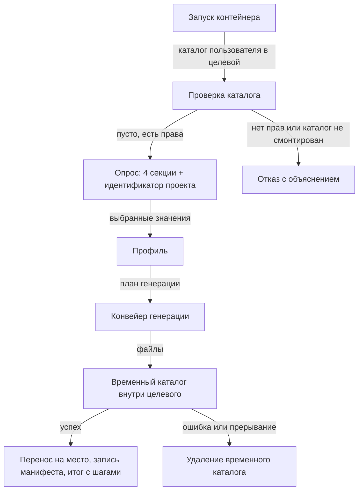
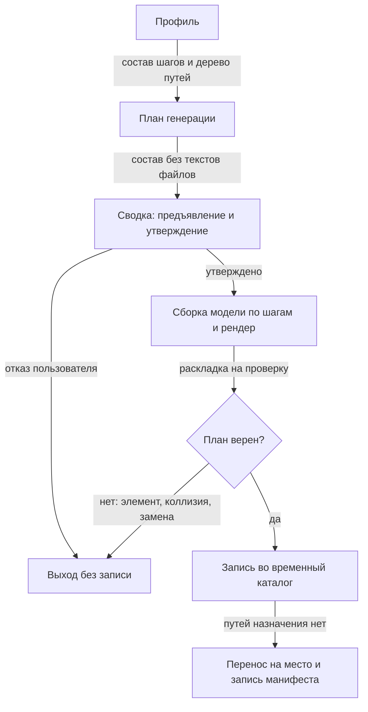
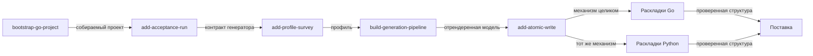
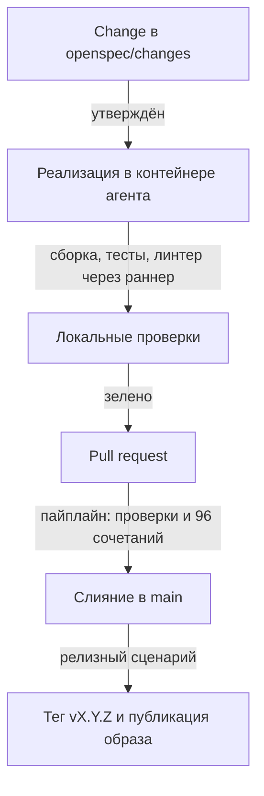

# План реализации Extruder v1

Как из принятых решений получается работающий инструмент: схема работы Extruder, конвейер
генерации, цепочка из восьми изменений по пяти этапам, технологический процесс разработки. Состав
решений — [`extruder-design.md`](./extruder-design.md), имена понятий — [`domain-language.md`](./domain-language.md).

---

## Навигация

- [Что строим](#что-строим)
- [Как работает Extruder](#как-работает-extruder)
- [Конвейер генерации](#конвейер-генерации)
- [Порядок реализации](#порядок-реализации)
- [Технологический процесс](#технологический-процесс)
- [Где что выполняется](#где-что-выполняется)
- [Критерии готовности](#критерии-готовности)
- [Риски и ограничения](#риски-и-ограничения)
- [Версионирование](#версионирование)

---

## Что строим

Extruder — CLI-инструмент на Go, распространяемый образом контейнера. Пользователь монтирует
пустой каталог, отвечает на вопросы опроса и получает начальную структуру проекта под выбранный
архитектурный профиль: дерево каталогов, файл сборки, конфигурацию линтера, сквозной пример
одного домена и проходящий тест.

Профиль собирается из четырёх измерений — 96 допустимых сочетаний:

| Измерение | Значения | Выбор |
|-----------|----------|-------|
| Язык | `go`, `python` | одиночный |
| Тип проекта | `monolith`, `modular-monolith`, `service`, `distributed` | одиночный |
| Архитектура | `clean-architecture`, `ports-adapters`, `layered` | одиночный |
| Паттерны | `ddd`, `cqrs` | множественный, допустим пустой набор |

---

## Как работает Extruder

Один запуск — от старта контейнера до записанной начальной структуры.



Ключевое свойство: до момента переноса целевой каталог не изменён. Прерывание на любом шаге
оставляет его ровно таким, каким он был.

---

## Конвейер генерации

Профиль превращается в начальную структуру не наложением файлов, а сборкой модели проекта:
накладка объявляет шаги плана, шаг меняет модель, текст файлов получается рендером модели один
раз ([DEC-013](./extruder-design.md#конвейер-генерации)). Между профилем и записью стоят две
точки отказа: сводка с планом и проверка плана.



План выводится из профиля и версии инструмента, поэтому одинаковый профиль на одной версии даёт
одинаковое дерево ([DEC-034](./extruder-design.md#конвейер-генерации)). Текстов файлов план
не содержит: сводка предъявляет состав, а не тысячи строк.

### Шаги плана

Порядок шагов — стратегия сборки: сначала шаг, вводящий предмет, затем шаги, меняющие его
([DEC-014](./extruder-design.md#конвейер-генерации)). Шаги паттернов условны — они появляются
в плане только если значение выбрано в опросе.

| Шаг | Что вносит в модель | Какие элементы трогает | Условие применения |
|-----|---------------------|------------------------|--------------------|
| Язык | Язык, раскладку путей, идентификатор проекта, оснастку | Корень модели, оснастка вне модели | всегда |
| Тип проекта | Модули или сервисы и их имена | Модули | всегда |
| Архитектура | Слои модуля, направление зависимостей, предметы сквозного примера | Слои, предметы, контракты, сценарии | всегда |
| `ddd` | Объект-значение и доменное событие у сущности сквозного примера | Предметы уже введённых модулей | только если `ddd` выбран |
| `cqrs` | Контракт чтения и контракт записи вместо одного контракта репозитория, команду и запрос вместо одного сценария | Контракты, сценарии | только если `cqrs` выбран; после `ddd` |

Оснастка — файл сборки, цели сборки, конфигурация линтера, `.gitignore`, `README.md` — в модель
не входит: её пишет одна накладка, и правило принадлежности элемента модели её не захватывает
([DEC-035](./extruder-design.md#конвейер-генерации)). В план и в предъявляемое дерево оснастка
входит наравне с остальным.

### Пример: `go + modular-monolith + clean-architecture + ddd + cqrs`

Профиль самого Extruder ([DEC-028](./extruder-design.md#устройство-extruder)). Сначала план
по шагам:

```text
Шаг 1 — язык go
  раскладка cmd/ + internal/, идентификатор проекта
  оснастка: go.mod, Makefile, .golangci.yml, .gitignore, README.md
Шаг 2 — тип проекта modular-monolith
  модули orders и catalog
Шаг 3 — архитектура clean-architecture
  слои domain, application, infrastructure в каждом модуле
  предметы: сущность Order, контракт OrderRepository, сценарий ConfirmOrder,
            обработчик, репозиторий в памяти, тест инварианта
Шаг 4 — паттерн ddd
  объект-значение Money и доменное событие OrderConfirmed у сущности Order
Шаг 5 — паттерн cqrs
  OrderRepository → контракт записи (домен) и контракт чтения (приложение)
  ConfirmOrder → сценарий-команда и сценарий-запрос GetOrder, модель чтения OrderView

Рендер: 24 пути, коллизий нет. Манифест добавляется при переносе.
```

Затем дерево результата — модуль `orders` целиком, `catalog` строкой, потому что его состав
повторяет первый:

```text
.
├── .extruder.yaml                    манифест, пишется при переносе
├── .gitignore                        шаг 1
├── .golangci.yml                     шаг 1
├── Makefile                          шаг 1
├── README.md                         шаг 1
├── go.mod                            шаг 1
├── cmd/app/main.go                   шаг 1
└── internal/
    ├── orders/
    │   ├── domain/
    │   │   ├── order.go              шаг 3 — сущность; шаг 4 — Money, OrderConfirmed
    │   │   ├── order_test.go         шаг 3 — тест инварианта сущности
    │   │   └── write_repository.go   шаг 5 — контракт записи
    │   ├── application/
    │   │   ├── confirm_order.go      шаг 3 — сценарий; шаг 5 — сведён к команде
    │   │   ├── get_order.go          шаг 5 — сценарий-запрос
    │   │   └── read_repository.go    шаг 5 — контракт чтения и модель чтения
    │   └── infrastructure/
    │       ├── http_handler.go       шаг 3 — обработчик
    │       ├── memory_write.go       шаг 3 — репозиторий в памяти; шаг 5 — только запись
    │       └── memory_read.go        шаг 5 — репозиторий чтения в памяти
    └── catalog/                      те же девять путей второго модуля (шаги 2–5)
```

Соответствие взаимно однозначно: у каждого пути дерева назван шаг, который его породил, и каждый
шаг плана виден хотя бы в одном пути. Единственное исключение названо явно — манифест: он
не порождается шагом, а пишется при переносе
([DEC-025](./extruder-design.md#манифест-и-повторный-запуск)).

### Точки отказа

- **Отказ пользователя в сводке.** Ни один файл ещё не создан, выход без записи.
- **Отказ проверки плана.** Ссылка шага на отсутствующий элемент модели, коллизия путей — в том
  числе между оснасткой и рендером — или замена ранее заданного элемента без объявления
  ([DEC-036](./extruder-design.md#конвейер-генерации)). Проверка идёт до записи, целевой каталог
  не изменён.
- **Ошибка записи во временный каталог.** Временный каталог удаляется, целевой остаётся таким,
  каким был.
- **Занятый путь назначения перед переносом.** Между проверкой пустоты каталога и переносом
  проходит весь опрос, поэтому пути проверяются ещё раз. Путь, не входящий в подтверждённый
  список предупреждения повторного запуска
  ([DEC-026](./extruder-design.md#манифест-и-повторный-запуск)), останавливает перенос.
- **Аварийное завершение.** Во временном каталоге остаётся профиль; следующий запуск предлагает
  продолжить с него, исполняя с нуля
  ([DEC-037](./extruder-design.md#целевой-каталог-и-запись)).

---

## Порядок реализации

Работа разбита на **пять этапов и восемь изменений** OpenSpec. Этап и изменение — разные единицы:
этап — зонтик с критерием приёмки, который на отдельном изменении не проверить («все 48 сочетаний
с `go` собираются»); изменение — единица работы с собственными `proposal.md` и `tasks.md`.
Разбиение идёт по швам зависимостей: Ядро можно закончить и проверить до появления второй языковой
раскладки, а поставка не зависит ни от чего, кроме готового приёмочного прогона.



| Этап | Изменение | Состав | Готов, когда |
|------|-----------|--------|--------------|
| Подготовка | `bootstrap-go-project` | `go.mod`, точка входа, каркас пакетов двух модулей, конфигурация линтера | `go-build` даёт бинарник `bin/extruder`, `go-test` и `go-lint` проходят |
| Подготовка | `add-acceptance-run` | Каркас приёмочного прогона по свойствам, контракт точки входа генератора, фильтр реализованных значений | Прогон порождает профили из словаря, фильтр пуст, сборка и тесты зелёные |
| Ядро | `add-profile-survey` | Профиль и словарь значений, опрос на стандартной библиотеке, гейт целевого каталога | Опрос собирает профиль, отказ без терминала и на недоступном каталоге предъявлен до первого вопроса |
| Ядро | `build-generation-pipeline` | План генерации и сводка, модель проекта, шаги, рендер, проверка плана | План собирается из профиля и предъявляется в сводке, проверка отклоняет отсутствующий элемент и коллизию путей |
| Ядро | `add-atomic-write` | Временный каталог и перенос, манифест, повторный запуск, продолжение после аварии | Отрендеренная модель переносится в целевой каталог, манифест читается повторным запуском |
| Раскладки Go | — | Базовое дерево `go.mod`, `cmd/`, `internal/`, накладки типов проекта, трёх архитектур, `ddd`, `cqrs`, сквозной пример | Все 48 сочетаний с `go` собираются, тест внутри проходит, `golangci-lint` чист |
| Раскладки Python | — | Базовое дерево src-layout, `pyproject.toml` с `uv`, те же накладки для Python | Все 48 сочетаний с `python` проходят `pytest` и `ruff` |
| Поставка | — | `Dockerfile` на `scratch`, цель сборки образа, пайплайн проверок и публикации, файл версии и релизный сценарий | Тег `vX.Y.Z` даёт опубликованный образ в реестре |

Порядок двух изменений подготовки не переставляется: приёмочный прогон объявляет точку входа
генератора ([DEC-042](./extruder-design.md#проверки-и-поставка)) и потому идёт раньше всех трёх
изменений Ядра, но позже `bootstrap-go-project` — компилировать его не во что.

Приёмочный прогон проверяет профили по свойствам — генерируется, внутренний тест проходит, линтер
чист ([DEC-030](./extruder-design.md#проверки-и-поставка)), — и берёт только профили из списка
реализованных значений словаря. Список растёт по мере закрытия этапов и в конце «Раскладок Python»
даёт ровно 96 профилей; golden-снимки ожидаемых деревьев отвергнуты.

---

## Технологический процесс

Цикл одного изменения — от постановки до релиза.



Правила процесса, действующие на каждом шаге:

- ветка отражает один поток изменений, `main` защищена — [GIT-005](../rules/git-rules.md#рабочая-ветка);
- заголовок коммита — `EXT-NNN: описание задачи`, номер и описание подтверждаются
  до коммита — [GIT-009](../rules/git-rules.md#формат-сообщения-коммита),
  [GIT-010](../rules/git-rules.md#формат-сообщения-коммита);
- после любой правки `Makefile` обязателен прогон `sh tools/make-lint/check.sh` —
  [MAKE-004](../rules/makefile-rules.md#локальный-прогон-проверки-make-004);
- содержимое `openspec/changes/archive/` не читается никогда —
  [READ-004](../rules/reading-rules.md#запрет-каталогов-read-004).

---

## Где что выполняется

Разделение существенно: в контейнере агента нет ни `make`, ни `docker`, ни Go.

| Действие | Место | Команда |
|----------|-------|---------|
| Правка кода и документов | контейнер агента | — |
| Проверка объёма секций `Makefile` | контейнер агента | `sh tools/make-lint/check.sh` |
| Сборка, тесты, линтер Go | хост через раннер | `tools/host-runner/call.sh go-test` |
| Подготовка окружения, `openspec init` | хост | `make init`, `make openspec-init` |
| Приёмочный прогон 96 сочетаний | хост и пайплайн | цель `Makefile` |
| Сборка и публикация образа | пайплайн по тегу | GitHub Actions |

Раннер должен быть запущен на хосте (`python3 tools/host-runner/runner.py`), иначе вызов вернёт
недоступность. Цель, не внесённая в белый список, отклоняется кодом `400`. Инструменты Go живут
на хосте: каталоги задают `GO_BIN_DIR` и `GO_TOOLS_DIR`, линтер ставится целью `go-tools`
([DEC-040](./extruder-design.md#устройство-extruder)). Раннер, запущенный до установки Go,
держит прежнее окружение — после установки его нужно перезапустить.

---

## Критерии готовности

| Проверка | Что подтверждает | Где выполняется |
|----------|------------------|-----------------|
| Юнит-тесты Extruder | Разбор профиля, вывод плана, сборка модели, рендер и проверка плана | локально и в пайплайне |
| Приёмочный прогон 96 сочетаний | Каждый профиль собирается, его тест проходит, линтер чист | локально и в пайплайне |
| Приёмочный прогон по фильтру | Профили реализованных значений словаря проходят три свойства; размер фильтра показывает покрытие | локально и в пайплайне |
| `tools/make-lint/check.sh` | Секции `Makefile` в пределах 30 строк | локально и в пайплайне |
| `golangci-lint` | Код самого Extruder | локально и в пайплайне |
| Повторный запуск в готовом каталоге | Модель читается из манифеста, существующие пути плана перечисляются предупреждением до записи | ручная проверка этапа «Ядро» |

---

## Риски и ограничения

> **Внимание:** перечисленное принято осознанно и не является дефектом плана.

- **Рендерер модели на каждый язык.** Самая крупная новая работа этапа «Ядро»: текст файлов
  порождает не накладка, а рендерер, и он свой у Go и у Python. Взамен накладка упрощается
  до объявления шагов, а объём работы виден до начала этапа, а не посреди него.
- **Эквивалентность паттерна между языками не следует из устройства.** Модель включает язык
  ([DEC-035](./extruder-design.md#конвейер-генерации)), поэтому «`ddd` в Python означает то же,
  что в Go» не выводится, а удерживается приёмочным прогоном 96 профилей и ревью раскладок.
- **sha256 в манифесте хранятся, но не читаются.** Поле справочное
  ([DEC-025](./extruder-design.md#манифест-и-повторный-запуск)); при первом расхождении его
  следует удалить, а не начинать использовать задним числом.
- **Повторный запуск перезаписывает правленные вручную файлы.** Защита снята
  ([DEC-026](./extruder-design.md#манифест-и-повторный-запуск)); взамен существующие пути плана
  перечисляются предупреждением до записи, отказ бесплатен, история правок остаётся
  у пользователя в системе контроля версий.
- **Раздел «Конвейер генерации» — самый большой в документе.** Осознанный отход
  от [DOC-011](../rules/documentation-rules.md#структура-файла): вынос конвейера в отдельный
  документ рассмотрен и отклонён.
- **Пустой фильтр приёмочного прогона выглядит как зелёная сборка.** Пока список реализованных
  значений пуст, прогон проходит, не проверив ни одного профиля. Защита — не молчание, а число:
  прогон печатает, сколько профилей взято из 96, и это число читается как показатель этапа.
- **Инструменты Go у разработчиков могут расходиться.** Контейнерный прогон отклонён
  ([DEC-040](./extruder-design.md#устройство-extruder)), поэтому версия Go и `golangci-lint`
  на машине разработчика — его собственное состояние; единый вердикт даёт только пайплайн.
- **Время приёмочного прогона.** 96 сочетаний с компиляцией и линтером — минуты на каждый
  прогон; при росте числа значений время растёт произведением, а не суммой.
- **Два расхождения с поставкой kit'а.** Цели сборки в корневом `Makefile` и правка белого списка
  в `tools/host-runner/runner.py` расходятся с `.sdd-kit-manifest.json`: при переустановке kit'а
  расхождение придётся разрешать вручную.
- **Отсутствие Go в контейнере агента.** Любая сборка и любой тест идут через раннер на хосте;
  без запущенного раннера агент не может проверить собственную работу.
- **Версия kit'а не зафиксирована.** Установщик указывает на основную ветку, поэтому набор правил
  может измениться между установками. На v1 не влияет: kit в поставку Extruder не входит.

---

## Версионирование

| Версия | Дата | Задача | Агент | Модель | Описание изменений |
|--------|------|--------|-------|--------|--------------------|
| 1.0.0 | 2026-09-30 | Запрос пользователя: выжимка плана со схемами и пошаговой реализацией по итогам сессии проектирования | Claude Code | Claude Opus 5 | Начальное создание: назначение и состав Extruder v1, схема одного запуска, конвейер генерации с порядком накладок, четыре этапа реализации с критериями готовности, технологический процесс от change до релиза, таблица мест выполнения команд, критерии готовности и перечень принятых рисков |
| 1.0.1 | 2026-09-30 | Запрос пользователя: `/domain-modeling` — свести терминологию Extruder к каноническим именам | Claude Code | Claude Opus 5 | Терминология приведена к [`domain-language.md`](./domain-language.md) по [TERM-009](../rules/terminology.md#согласованность): «дерево», «скелет», «выход» и «готовая раскладка» заменены на «начальная структура проекта», «манифест сборки» — на «файл сборки», «имя модуля» в схеме опроса — на «идентификатор проекта», «каталог хоста» — на «каталог пользователя»; в критериях готовности «каждое сочетание» заменено на «каждый профиль». Счётные обороты вида «96 сочетаний» и заголовки этапов «Раскладки Go» и «Раскладки Python» сохранены: первые не называют профиль, вторые называют реализацию правил размещения. Состав плана и схемы не изменились |
| 1.1.0 | 2026-09-30 | EXT-005 / OpenSpec change `revise-generation-pipeline` | Claude Code | Claude Opus 5 | Раздел «Конвейер генерации» переписан под пересмотренный механизм: схема ведёт от профиля через план, сводку с утверждением, сборку модели с рендером и проверку плана к переносу с записью манифеста; добавлены таблица шагов (что шаг вносит в модель, какие элементы трогает, условие применения — условность `ddd` и `cqrs` выражена строкой таблицы), пример профиля `go + modular-monolith + clean-architecture + ddd + cqrs` из плана по шагам и дерева результата с модулем `orders` целиком, и перечень точек отказа. Схема «Как работает Extruder» и схема порядка реализации приведены к новым именам. Состав и критерий готовности этапа «Ядро» переписаны с генерации на заглушечных накладках на сборку и предъявление плана; в критериях готовности обновлены строки юнит-тестов и повторного запуска. Из рисков снята молчаливая потеря файла — механизм её больше не порождает; добавлены риски рендерера на каждый язык, неподтверждаемой эквивалентности паттерна между языками, неиспользуемых sha256, перезаписи ручных правок и объёма раздела |
| 1.2.0 | 2026-09-30 | EXT-007: спроектировать цепочку изменений реализации | Claude Code | Claude Opus 5 | Раздел «Порядок реализации» пересобран: вместо четырёх изменений — пять этапов и восемь изменений, этап и изменение разделены как единица приёмки и единица работы. В цепочку добавлены два изменения подготовки: `bootstrap-go-project` (собираемый проект самого Extruder) и `add-acceptance-run` (каркас приёмочного прогона по свойствам, объявляющий точку входа генератора по [DEC-042](./extruder-design.md#проверки-и-поставка)); этап «Ядро» разбит на `add-profile-survey`, `build-generation-pipeline` и `add-atomic-write`. Схема швов и таблица этапов переписаны с учётом изменений и критериев их готовности; добавлено пояснение о непереставляемом порядке подготовки и о фильтре реализованных значений словаря. В «Критерии готовности» добавлена строка приёмочного прогона по фильтру, в «Где что выполняется» — каталоги инструментов Go, цель `go-tools` и необходимость перезапуска раннера после установки Go. В риски добавлены два: пустой фильтр приёмочного прогона читается как зелёная сборка, и версии инструментов Go у разработчиков могут расходиться, поскольку контейнерный прогон отклонён |
