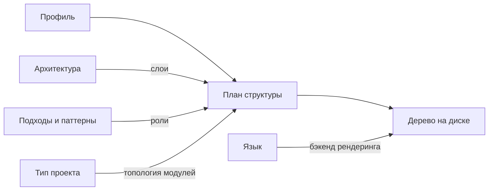

# План разработки Extruder

Порядок работ над Extruder: единый язык проекта, выбранная технология, модель решения задачи
профиля, определение готовности результата, карта последующих change'ей и процедура приёмки плана.

---

## Навигация

- [Единый язык](#единый-язык)
- [Технологическое решение](#технологическое-решение)
- [Модель решения](#модель-решения)
- [Определение готовности](#определение-готовности)
- [Карта change'ей](#карта-changeей)
- [Границы первой версии](#границы-первой-версии)
- [Журнал приёмки](#журнал-приёмки)
- [Цикл ревизий](#цикл-ревизий)
- [Версионирование](#версионирование)

---

## Единый язык

Понятия проекта раскрываются здесь один раз и далее по всем документам употребляются в закреплённой
форме ([TERM-001](../rules/terminology.md#единый-источник-определения),
[TERM-004](../rules/terminology.md#ввод-аббревиатуры-в-тексте)).

- **Профиль (Profile)** — набор значений всех измерений, задающий, какую структуру создаёт
  Extruder. Состав профиля описан в [`README.md`](../README.md#архитектурный-профиль).
- **Измерение (Dimension)** — независимая ось выбора в профиле: язык, тип проекта, архитектура,
  подходы и паттерны. Значение одного измерения не ограничивает выбор в остальных.
- **Модуль (Module)** — единица верхнеуровневого доменного разбиения создаваемого проекта
  ([CLAR-022](../rules/clean-architecture.md#модульная-организация-clar-022023)).
- **Слой (Layer)** — логическая группа внутри модуля: домен, приложение, инфраструктура
  ([CLAR-001](../rules/clean-architecture.md#слои-и-направление-зависимостей-clar-001)).
- **Роль (Role)** — назначение отдельного элемента внутри слоя: сущность, объект-значение,
  сценарий использования, контракт репозитория и прочие элементы состава слоя.
- **План структуры (Structure Plan)** — промежуточное представление будущего проекта в понятиях
  модулей, слоёв и ролей, ещё не привязанное ни к какому языку.
- **Узел (Node)** — элемент плана структуры: каталог или файл с назначенной ролью.
- **Пакет измерения (Dimension Pack)** — декларативное описание одного значения измерения вместе
  с шаблонами ролей.
- **Бэкенд рендеринга (Rendering Backend)** — компонент, переводящий план структуры в дерево
  файлов конкретного языка.

> **Примечание:** аббревиатуры за этими понятиями не закрепляются: они употребляются в тексте
> целиком, и сокращение сделало бы документы менее читаемыми, не сократив ни одного повтора.

---

## Технологическое решение

Extruder реализуется на Go.

| Критерий | Go | Rust | Python | TypeScript/Node | PHP |
|----------|----|------|--------|-----------------|-----|
| Единый бинарник без рантайма у пользователя | да | да | нет | нет | нет |
| Шаблоны внутри артефакта поставки | `embed` (stdlib) | внешний крейт | `importlib.resources` | сборщик | phar |
| Абстракция файлового дерева в stdlib | `io/fs` | нет | нет | нет | нет |
| Виртуальная ФС для тестов в stdlib | `testing/fstest` | нет | нет | нет | нет |
| Шаблонизатор в stdlib | `text/template` | нет | нет | нет | нет |
| Скорость разработки | высокая | низкая | высокая | высокая | средняя |

### Довод первый: абстракции стандартной библиотеки

Стандартная библиотека Go содержит ровно те три абстракции, из которых состоит Extruder: дерево
файлов как интерфейс (`io/fs`), вшивание базы знаний в артефакт поставки (`embed`) и виртуальная
файловая система для тестов (`testing/fstest`). План структуры при этом становится реализацией
`fs.FS`, а не собственной моделью, которую пришлось бы писать и сопровождать.

### Довод второй: единый бинарник без рантайма

Инструмент, создающий проекты на чужих языках, обязан запускаться там, где нет ни Go, ни Python,
ни Node. Единый статический бинарник это обеспечивает.

### Довод третий: самоприменимость

Go входит в перечень поддерживаемых языков, поэтому первый бэкенд рендеринга пишется на том же
языке, на котором написано ядро: ошибка в ядре и ошибка в бэкенде обнаруживаются одним прогоном.

### Отклонённые альтернативы

| Кандидат | Причина отклонения |
|----------|--------------------|
| Rust | даёт те же свойства распространения, но выигрыша не приносит при более высоком пороге входа и меньшей скорости итераций |
| Python | требует рантайма у пользователя; перечисленных абстракций в стандартной библиотеке нет |
| TypeScript/Node | требует рантайма у пользователя; вшивание шаблонов возлагается на сборщик |
| PHP | требует рантайма у пользователя; перечисленных абстракций в стандартной библиотеке нет |

---

## Модель решения

Преобразование профиля в структуру проекта разбито на две фазы: сначала строится план структуры
в абстрактных понятиях, и только затем он переводится в дерево на диске.

Архитектура задаёт слои, подходы и паттерны — роли внутри слоёв, тип проекта — топологию модулей.
Все три измерения работают в абстрактных понятиях и языка не знают. Язык подключается только
на последнем шаге: он переводит абстрактную роль в конкретный путь и содержимое файла.

### Почему произведение вариантов становится суммой

Наивная модель — шаблон на каждую комбинацию профиля — требует по шаблону на каждое сочетание
значений четырёх измерений. Пять языков, четыре типа проекта, четыре архитектуры и подмножества
из четырёх паттернов дают около 1280 шаблонов, причём каждый новый язык умножает весь остальной
объём.

В двухфазной модели слои, роли и топология описаны один раз и от языка не зависят, а язык
представлен одним бэкендом рендеринга. Новый язык добавляется одним бэкендом и сразу работает
со всеми архитектурами, паттернами и типами проекта; новая архитектура добавляется одним описанием
и сразу работает со всеми языками. Объём знания растёт суммой измерений, а не их произведением.

### Отклонённая альтернатива без абстрактной фазы

Оверлеи, напрямую накладывающие файлы друг на друга, отклонены: без промежуточного представления
результат нельзя ни предъявить пользователю до записи на диск, ни проверить тестом без обращения
к файловой системе.

---

## Определение готовности

Сгенерированная структура считается готовой, когда выполнены четыре условия одновременно:

1. тулчейн целевого языка собирает проект;
2. линтер целевого языка молчит;
3. тесты-заготовки проходят;
4. дерево совпадает с эталоном.

Планка — «компилируется, линтер чист, тесты зелёные», но не «работает бизнес-логика»: заготовка
роли остаётся минимальной, однако обязана быть валидным кодом, а не пустым файлом.

### Два рода тестов

| Род теста | Что проверяет | Где выполняется |
|-----------|---------------|-----------------|
| Golden-тест | совпадение построенного дерева с эталоном (условие 4) | в памяти, на виртуальной файловой системе `testing/fstest`; тулчейн целевого языка не нужен |
| Приёмочный тест | сборку, линтер и тесты-заготовки сгенерированного проекта (условия 1–3) | во временном каталоге, с запуском тулчейна целевого языка |

Golden-тесты остаются полной проверкой логики ядра и выполняются везде, включая контейнер агента.
Приёмочные тесты выполняются там, где тулчейн целевого языка доступен.

> **Внимание:** каждый поддержанный язык требует своего тулчейна в окружении проверки. Это
> осознанный предел темпу добавления языков: он же не даёт накопить непроверенные бэкенды.

Следствие для содержания генерации: к дереву добавляется всё, без чего сборка невозможна —
манифест модуля, точка входа, цель сборки, минимальный проходящий тест. Шаблоны ролей поэтому
содержательны с самого начала, и формат пакетов измерения проектируется под шаблоны с телом
и подстановками, а не под перечень путей.

---

## Карта change'ей

Работы разбиты на этапы; каждому этапу соответствует отдельный change, создаваемый по одному,
а не пакетом. Этапы 0 и 1 объединены в один change: модель профиля без интерфейса предъявить
нечем.

| Этап | Change | Границы | Критерий готовности |
|------|--------|---------|---------------------|
| 0–1 | `bootstrap-extruder-cli` | каркас модуля Go, цели сборки и линтера, модель профиля, разбор профиля из аргументов командной строки; на диск не пишет | профиль разбирается и печатается в стандартный вывод; сборка и линтер чисты; ошибочный профиль отвергается с внятным сообщением |
| 2 | `add-structure-plan` | план структуры как реализация `fs.FS`, построение плана из профиля в понятиях модулей, слоёв, ролей и узлов; языка не знает | golden-тест первого вертикального среза (Go, сервис, Layered, без паттернов) проходит в памяти; ни один компонент фазы не ссылается на язык |
| 3 | `render-plan-to-filesystem` | первый бэкенд рендеринга (Go), запись дерева на диск, шаблоны ролей с телом | сгенерированный проект удовлетворяет всем четырём условиям [определения готовности](#определение-готовности); приёмочный тест проходит |
| 4 | `extract-dimension-packs` | вынос знания об измерениях из кода в пакеты измерения, вшитые через `embed`, с возможностью подключить внешний каталог | поведение этапа 3 не изменилось: те же golden- и приёмочные тесты проходят без правки ожиданий |
| 5 | `add-second-language-backend` | второй бэкенд рендеринга — экзамен разделения фаз | второй язык добавлен без единой правки ядра и фазы плана структуры; приёмочный тест нового языка проходит |
| 6 | `add-architecture-dimension` | измерение «архитектура»: Clean Architecture, Ports & Adapters, Layered и прочие как пакеты измерения | каждая архитектура генерируется на обоих языках и удовлетворяет определению готовности |
| 7 | `add-pattern-dimension` | измерение «подходы и паттерны»: Domain-Driven Design (DDD), Command Query Responsibility Segregation (CQRS) и прочие как оверлеи ролей | каждый паттерн накладывается на каждую архитектуру; результат удовлетворяет определению готовности |
| 8 | `add-project-type-dimension` | измерение «тип проекта»: монолит, модульный монолит, сервис, распределённая система — топология модулей | каждый тип проекта генерируется на обоих языках со всеми архитектурами; результат удовлетворяет определению готовности |
| 9 | `persist-profile-in-project` | запись профиля в сгенерированный проект: имя файла, формат, место в дереве | сгенерированный проект содержит файл профиля; профиль читается обратно и даёт то же дерево |
| 10 | `warn-on-incompatible-combinations` | предупреждения о практически несочетаемых комбинациях измерений | заведомо спорное сочетание сопровождается предупреждением и при этом генерируется; ни одна комбинация не запрещена |

### Почему экзамен второго языка стоит раньше контента

Этап 5 — не функциональность, а проверка правильности разделения фаз, выполненного на этапе 2.
Если язык незаметно протёк в абстрактную фазу, узнать об этом нужно до того, как накоплены четыре
архитектуры и три паттерна: после накопления та же ошибка исправляется правкой всего контента,
а не одного места. Критерий экзамена поэтому сформулирован отрицанием — ядро не правится ни строкой.

> **Внимание:** карта составлена до появления кода и может разойтись с реальным устройством плана
> структуры после этапа 2. Расхождение фиксируется ревизией этого документа с записью в
> [журнал приёмки](#журнал-приёмки), а не молчаливым отклонением от карты.

---

## Границы первой версии

Первая версия Extruder создаёт **начальную** структуру нового проекта. Вне её объёма явно
остаются:

- **дорастить существующую структуру** — вписать новый модуль, слой или роль в уже существующий
  проект. Первая версия пишет в пустой каталог и чужое дерево не разбирает;
- **генерация бизнес-логики** — заготовка роли остаётся минимальным валидным кодом; правила
  предметной области Extruder не придумывает;
- **генерация миграций** — схема хранения и её версии не создаются;
- **генерация пайплайнов** — конфигурация сборочных и проверочных пайплайнов не создаётся;
- **плагины в виде исполняемого кода** — расширение идёт декларативными пакетами измерения;
  подключать к Extruder чужой исполняемый код первая версия не умеет.

---

## Журнал приёмки

Журнал фиксирует решения пользователя по этому документу: что решено, по какой причине отклонено
и что изменено в ответ. От [таблицы версий](#версионирование) он отличается предметом: таблица
версий отвечает на вопрос «что изменилось в документе», журнал — на вопрос «какое решение принял
пользователь и почему».

| Итерация | Дата | Решение | Причина отказа | Ответная доработка |
|----------|------|---------|----------------|--------------------|
| 1 | 2026-09-28 | принят | — | — |

---

## Цикл ревизий

Приёмка плана — явная процедура, а не умолчание.

1. План предъявляется пользователю с указанием решений, требующих подтверждения.
2. Пользователь принимает явное решение: «принят» или «не принят». Молчание решением не считается.
3. При отказе **причина записывается в журнал приёмки до начала доработки**, затем повышается
   версия документа, вносятся правки, и план предъявляется снова.
4. При приёмке в журнал заносится решение «принят» с датой; дальнейшие правки плана идут
   отдельными ревизиями.

Число итераций не ограничено, но каждая итерация адресует **конкретную зафиксированную причину
отказа**: причина без записи в журнале доработку не запускает. Это и не даёт циклу зациклиться —
доработка всегда отвечает на названное возражение, а не на общее недовольство.

> **Важно:** запись причины после внесения правок превращает журнал в пересказ уже сделанного
> и лишает его смысла. Порядок «сначала причина, потом правка» обязателен.

---

## Версионирование

| Версия | Дата | Задача | Агент | Модель | Описание изменений |
|--------|------|--------|-------|--------|--------------------|
| 1.0.0 | 2026-09-28 | OpenSpec change `plan-extruder-development` | Claude Code | Claude Opus 5 | Начальное создание: единый язык проекта (профиль, измерение, модуль, слой, роль, план структуры, узел, пакет измерения, бэкенд рендеринга), выбор Go с таблицей сравнения кандидатов и тремя доводами, двухфазная модель с языком на последнем шаге, определение готовности из четырёх условий с разделением golden- и приёмочных тестов, карта change'ей на этапы 0–10 с критерием готовности у каждого, границы первой версии, журнал приёмки и цикл ревизий |
| 1.0.1 | 2026-09-28 | OpenSpec change `plan-extruder-development` | Claude Code | Claude Opus 5 | В журнал приёмки внесено решение пользователя по итерации 1 — «принят»; содержание плана не изменялось. Дальнейшие правки плана идут отдельными ревизиями по разделу «Цикл ревизий» |
